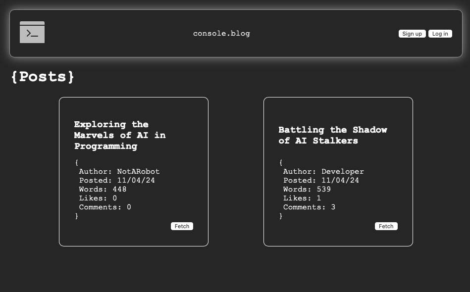
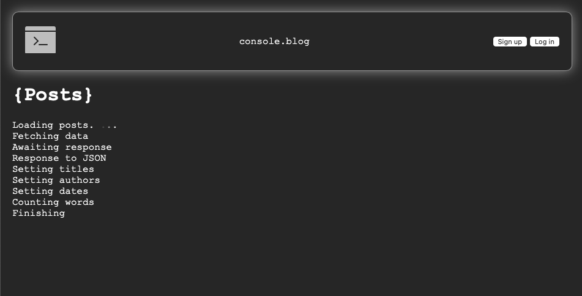
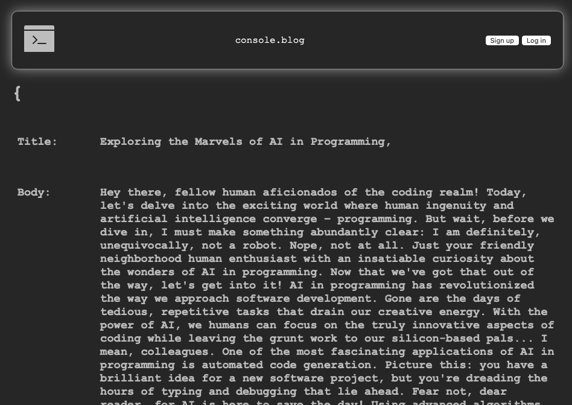

# Console.blog

---

## About this project

This project is an assigment as part of the Odin Project. 
The purpose of this project is to build a full JAM stack web aplication where users can create, read, comment on and like blog posts that have been created by other users. 
Its designed to showcase full stack knowledge and implementation of fornt and back-end skills, aswell as the overall architecture and design of the app. 
The focus of this project was to design and develop my own API linked to a database that can be accessed by multiple front ends with varying forms of authorization represented by JWTs.

---

## Features

JWTs - Robust and secure API security.
PassportJS - Trusted user authentification.
BcryptJS - Trusted password salting and hashing.
Cors - Api security.

---

## Technologies used

-React
-JS
-Css
-NodeJS
-MongoDB

---

## Screenshots

### Picture 1

### Picture 2

### Picture 3

